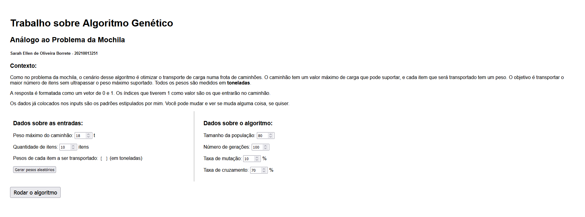

# TrabAlgoritmoGenetico
Trabalho de algoritmo genético da matéria de Inteligência Artificial - IC817 da UFRRJ, com a professora Gizelle, com o objetivo de resolver um problema semelhante ao da mochila.

Foi feito em Javascript e pode ser acessado [aqui](https://tartaponei.github.io/TrabAlgoritmoGenetico/).

## Contexto
Como no problema da mochila, o cenário desse algoritmo é otimizar o transporte de carga numa frota de caminhões. O caminhão tem um valor máximo de carga que pode suportar, e cada item que será transportado tem um peso. O objetivo é transportar o maior número de itens sem ultrapassar o peso máximo suportado. Todos os pesos são medidos em toneladas.

A resposta é formatada como um vetor de 0 e 1. Os índices que tiverem 1 como valor são os que entrarão no caminhão.

Os itens e seus pesos precisam ser gerados antes de rodar o algoritmo. Os pesos podem ser alterados a qualquer momento. Os dados já colocados nos inputs são os padrões estipulados por mim. Você pode mudar e ver se muda alguma coisa, se quiser.